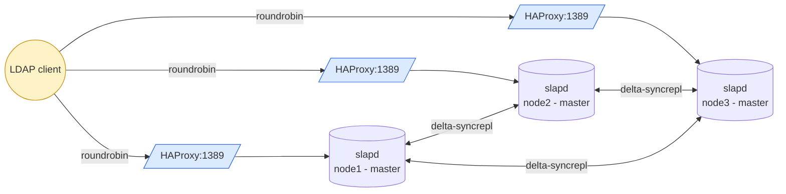

# HA Active-Active - N-way Multi-Master

OpenLDAP cluster where **every node accepts writes**. Replication is delta-syncrepl mesh: each peer pulls from each other peer's accesslog. Writes converge via `entryCSN` (timestamp + serverID).

> See [OpenLDAP Admin Guide - Replication](https://www.openldap.org/doc/admin26/replication.html).

## Topology (3 nodes)



- HAProxy on each VM: **`balance roundrobin`** (all peers are equal, all accept writes)
- `olcMirrorMode: TRUE` on every node
- Conflicts resolved by `entryCSN`. Apps requiring strict ordering should route writes to a single node.

## Quick start (Vagrant - 3 VMs)

The 3-VM test cluster lives under [`tests/`](tests/):

```bash
cd tests
vagrant up                                                      # boot cluster
./test-replication.sh \
  ldap://192.168.58.10 ldap://192.168.58.11 ldap://192.168.58.12
vagrant destroy -f                                              # tear down
```

| VM    | IP             | Notes |
|-------|----------------|-------|
| ldap1 | 192.168.58.10  | master + phpLDAPadmin enabled |
| ldap2 | 192.168.58.11  | master |
| ldap3 | 192.168.58.12  | master |

## Manual setup (no Vagrant)

On each VM (Docker required):

```bash
cd ha-active-active
cp .env.example .env
# Edit SERVER_ID (1, 2, 3...) and NODE_URIS (all peer LDAP URIs, including self)
./setup-node.sh
```

Always start node 1 first - peers need it to load the initial dataset.

## Per-VM ports

| Port  | Service |
|-------|---------|
| 389   | OpenLDAP (peer↔peer replication + direct client access) |
| 636   | OpenLDAP TLS |
| 1389  | HAProxy LDAP frontend (client-facing, roundrobin LB) |
| 1636  | HAProxy LDAPS frontend |
| 8404  | HAProxy stats UI (admin/admin) |
| 8080  | phpLDAPadmin (node 1 only via `--profile ui` / `ENABLE_PHPLDAPADMIN=true`) |

## Files

User-facing (deploy these on your real hosts):

| Path | Purpose |
|------|---------|
| `docker-compose.yml` | openldap + haproxy + (phpldapadmin) |
| `setup-node.sh` | per-node bootstrap (renders config, slapadd, starts compose) |
| `init-config/slapd-config.ldif.tmpl` | cn=config template (multimaster syncrepl placeholders) |
| `haproxy/haproxy.cfg.tmpl` | HAProxy template (roundrobin hardcoded) |
| `.env.example` | Per-node config template (SERVER_ID, NODE_URIS, ...) |

Test scaffolding (under `tests/`):

| Path | Purpose |
|------|---------|
| `tests/Vagrantfile` | 3-VM cluster definition |
| `tests/provision.sh` | Vagrant provisioner: install Docker + run setup-node.sh |
| `tests/test-replication.sh` | Write probe + cross-peer convergence check |
| `tests/distribute-ca.sh` | Bootstrap shared CA on ldap1, distribute to ldap2+ldap3, generate per-node certs |

Generated (git-ignored): `docker-compose.override.yml` - emitted by `setup-node.sh` only when `REPLICATE_CONFIG=true`, to pin slapd's listeners (see below).

Local data: `init-ldifs/replicator.ldif` (HA-only service account).
Local TLS material: `certs.sh` + `certs/` (idempotent renewal - see root README for cron). Backup dumps: `backup/`. Pulls from `../base-ldifs/` (shared directory data).

## Replicating `cn=config` (optional)

By default only `dc=example,dc=org` replicates. Everything that lives in
`cn=config` - `olcAccess` rules, overlays, schema, ppolicy, indices - stays on
the node that received the write, so an ACL added on node 1 is invisible to
nodes 2 and 3.

Set `REPLICATE_CONFIG=true` (same value, same `CONFIG_ADMIN_PASSWORD`, on
**every** node) and re-run `./setup-node.sh --reset`. `setup-node.sh` then:

- switches `olcServerID` to the URL form, identical on all nodes. Mandatory:
  the `cn=config` entry itself replicates, so a single-int `olcServerID: N`
  would be overwritten by whichever peer wrote last;
- adds a `syncprov` overlay on `olcDatabase={0}config` - without a provider
  overlay the config DB serves no sync context and consumers stall forever;
- adds one plain `refreshAndPersist` `olcSyncRepl` per peer (rid 101+). Not
  delta-syncrepl: the accesslog overlay is attached to `{1}mdb` only, so the
  config DB has no changelog to pull from;
- binds as `cn=adminconfig,cn=config`, the config rootDN - a rootDN bind
  bypasses the `{0}config` ACL, which otherwise denies every other DN;
- writes `docker-compose.override.yml` switching the openldap container to
  **`network_mode: host`** and pinning slapd's listeners to
  `ldap://<this-node-ip>:389 ldap://127.0.0.1:389` (+ the matching `ldaps://`).

Those last two points are one mechanism, not two. slapd only accepts the URL
form of `olcServerID` if one of the listed URLs matches one of its own
listeners - and that same match is what makes slapd **drop the syncrepl entry
pointing at itself**. Without it, every node consumes its own `cn=config`,
syncprov answers its own consumer thread with `(53) Server is unwilling to
perform`, and that poisons the provider session for the real consumers: their
data replication stalls indefinitely. The URL has to be the docker **host**
address, which a bridge-networked container cannot bind - hence host
networking. The override also resets `networks`, `ports` and `hostname`, which
compose (or older Docker Engines) reject alongside `network_mode: host`.

> The override sets `entrypoint:`, not `command:`. The image's ENTRYPOINT is
> already a complete slapd argv (`slapd -u ldap -g ldap -h "ldap:// ldaps://"
> -d 64`), so a `command:` would be *appended* to it and slapd would abort with
> a usage dump on the extra positional argument. Only `-h` is changed.

> One `olcSyncRepl` per peer over the **whole** `cn=config` - never several
> with narrower `searchbase`. Syncrepl entries on the same database share a
> single `contextCSN`: one advancing it makes the others believe they are
> current, and the consumer silently keeps stale entries while reporting an
> up-to-date `contextCSN`.

Verify after convergence - the same ACL must be visible from every node:

```bash
for h in 192.168.58.10 192.168.58.11 192.168.58.12; do
  echo "== $h"
  ldapsearch -x -H ldap://$h:389 -D cn=adminconfig,cn=config -w adminpasswordconfig \
    -b "olcDatabase={1}mdb,cn=config" olcAccess | grep -c olcAccess
done
```

## Database sizing (per node)

Each node has its **own** `cn=accesslog` DB - not replicated, fed by the local accesslog overlay. The default `olcDbMaxSize: 1 GiB` will saturate fast under high bind volume, causing `MDB_MAP_FULL` and cascading bind failures (ppolicy can't update its counters). Tune `olcAccessLogOps` / `olcAccessLogSuccess` / `olcAccessLogPurge` **on every node**, and live-resize `olcDbMaxSize` if needed (no restart required). See [root README - Database storage & sizing](../README.md#database-storage--sizing) for the full procedure and monitoring queries.
