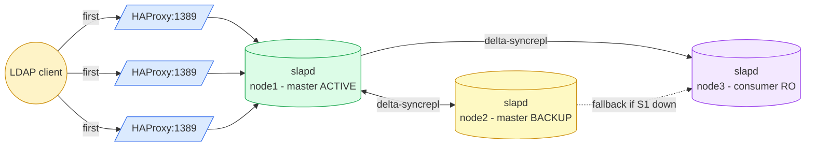

# HA Active-Passive - MirrorMode

OpenLDAP cluster with **two MirrorMode masters** (one active, one hot standby) plus optional **read-only consumers** for scale-out reads. HAProxy uses `balance first` so writes go to the primary master; on failure they switch to the backup master.

> See [OpenLDAP Admin Guide - Replication](https://www.openldap.org/doc/admin26/replication.html).

## Topology (3 nodes)



- Nodes 1 & 2: masters with `olcMirrorMode: TRUE`. HAProxy serves node 1 to clients; node 2 receives traffic only when node 1 is DOWN.
- Node 3 (and any `SERVER_ID >= 3`): pure read-only consumer. Writes are rejected (`Server unwilling to perform - shadow context`).
- Failover detection latency: HAProxy `inter=5s rise=2 fall=3` → DOWN after ~15s.

## Quick start (Vagrant - 3 VMs)

The 3-VM test cluster lives under [`tests/`](tests/):

```bash
cd tests
vagrant up
./test-replication.sh \
  ldap://192.168.58.10 ldap://192.168.58.11 ldap://192.168.58.12
vagrant destroy -f
```

### Failover test

```bash
# Stop the active master
vagrant ssh ldap1 -c 'sudo docker stop openldap'

# Wait for HAProxy to mark node1 DOWN (~15-20s), then write via any node's HAProxy
sleep 20
ldapadd -x -H ldap://192.168.58.11:1389 -D cn=admin,dc=example,dc=org -w adminpassword <<EOF
dn: cn=failover-test,ou=users,dc=example,dc=org
objectClass: inetOrgPerson
cn: failover-test
sn: t
EOF

# Restore primary - syncrepl back-syncs the entry from ldap2
vagrant ssh ldap1 -c 'sudo docker start openldap'
```

## VM roles

| VM    | IP             | Role       | Writes accepted? |
|-------|----------------|------------|------------------|
| ldap1 | 192.168.58.10  | master (active)  | yes (primary) |
| ldap2 | 192.168.58.11  | master (backup)  | yes (when promoted) |
| ldap3 | 192.168.58.12  | consumer (read-only) | **no** (shadow) |

## Manual setup

```bash
cd ha-active-passive
cp .env.example .env  # set SERVER_ID and NODE_URIS
./setup-node.sh
```

## Per-VM ports

Same as active-active. HAProxy uses `balance first` instead of `roundrobin`.

## Files

User-facing (deploy these on your real hosts):

| Path | Purpose |
|------|---------|
| `docker-compose.yml` | openldap + haproxy + (phpldapadmin) |
| `setup-node.sh` | Role-aware bootstrap (master if SERVER_ID ≤ 2, else consumer) |
| `init-config/slapd-config.ldif.tmpl` | cn=config template (mirror placeholders) |
| `haproxy/haproxy.cfg.tmpl` | HAProxy template (`balance first` hardcoded, node1 active, node2+ backup) |
| `.env.example` | Per-node config template |

Test scaffolding (under `tests/`):

| Path | Purpose |
|------|---------|
| `tests/Vagrantfile` | 3-VM cluster definition |
| `tests/provision.sh` | Vagrant provisioner |
| `tests/test-replication.sh` | Write probe (also detects consumer rejection) |
| `tests/distribute-ca.sh` | Bootstrap shared CA on ldap1, distribute to ldap2+ldap3, generate per-node certs |

Generated (git-ignored): `docker-compose.override.yml` - emitted by `setup-node.sh` only on a master when `REPLICATE_CONFIG=true`, to pin slapd's listeners (see below).

Local data: `init-ldifs/replicator.ldif` (HA-only service account).
Local TLS material: `certs.sh` + `certs/` (idempotent renewal - see root README for cron). Backup dumps: `backup/`. Pulls from `../base-ldifs/` (shared directory data).

## Replicating `cn=config` (optional, masters only)

By default only `dc=example,dc=org` replicates. Everything in `cn=config` -
`olcAccess`, overlays, schema, ppolicy, indices - stays on the node that
received the write.

Set `REPLICATE_CONFIG=true` (same value, same `CONFIG_ADMIN_PASSWORD`) on
**every** node and re-run `./setup-node.sh --reset`. Masters get the full
`cn=config`; consumers (`SERVER_ID >= 3`) get the `cn=schema` subtree only - a
consumer that pulled the whole `cn=config` would inherit the masters'
`olcMirrorMode: TRUE` and `olcServerID` and stop being read-only.

`setup-node.sh` then, on masters:

- switches `olcServerID` to the URL form, identical on both masters. Mandatory:
  the `cn=config` entry itself replicates, so a single-int `olcServerID: N`
  would be overwritten by the peer;
- adds a `syncprov` overlay on `olcDatabase={0}config` - without a provider
  overlay the config DB serves no sync context and consumers stall;
- adds one plain `refreshAndPersist` `olcSyncRepl` per master (rid 101, 102).
  Not delta-syncrepl: the accesslog overlay is attached to `{1}mdb` only, so
  the config DB has no changelog to pull from;
- binds as `cn=adminconfig,cn=config`, the config rootDN - a rootDN bind
  bypasses the `{0}config` ACL, which otherwise denies every other DN;
- writes `docker-compose.override.yml` switching the openldap container to
  **`network_mode: host`** and pinning slapd's listeners to
  `ldap://<this-node-ip>:389 ldap://127.0.0.1:389` (+ the matching `ldaps://`).

Those last two points are one mechanism. slapd only accepts the URL form of
`olcServerID` if one of the listed URLs matches one of its own listeners - and
that same match is what makes slapd **drop the syncrepl entry pointing at
itself**. Without it each master consumes its own `cn=config`, syncprov answers
its own consumer thread with `(53) Server is unwilling to perform`, and the
real consumers' data replication stalls. The URL has to be the docker **host**
address, which a bridge-networked container cannot bind - hence host
networking. The override also resets `networks`, `ports` and `hostname`, which
compose (or older Docker Engines) reject alongside `network_mode: host`.

> The override sets `entrypoint:`, not `command:`. The image's ENTRYPOINT is
> already a complete slapd argv, so a `command:` would be *appended* to it and
> slapd would abort with a usage dump. Only `-h` is changed.

> Masters use ONE `olcSyncRepl` over the whole `cn=config`, never several with
> narrower `searchbase`: syncrepl entries on the same database share a single
> `contextCSN`, so one advancing it makes the others silently skip changes.

On consumers, `REPLICATE_CONFIG=true` adds a **schema-only** slice instead: one
`olcSyncRepl` per master (rid 201, 202) with `searchbase="cn=schema,cn=config"`,
no `olcMirrorMode`, no `syncprov`, `olcServerID` untouched.

That slice is not cosmetic. A consumer's data syncrepl runs with
`schemachecking=on`, so an entry using an objectClass added at runtime on a
master is **rejected - and the rejection stalls the consumer's entire
replication stream**, silently, including every entry written afterwards.
Replicating `cn=schema` is what keeps the consumer able to accept those
entries.

Side effect to know about: the consumer's `{0}config` becomes a shadow, so
local `cn=config` writes on a consumer are refused with
`shadow context; no update referral`. Everything else in `cn=config` (ACLs,
overlays, indices) still has to be applied to consumers separately.

## Database sizing (per node)

Each master node has its **own** `cn=accesslog` DB - not replicated, fed by the local accesslog overlay. Default `olcDbMaxSize: 1 GiB` saturates fast under bind volume, causing `MDB_MAP_FULL` and cascading bind failures (ppolicy can't update its counters). Tune `olcAccessLogOps` / `olcAccessLogSuccess` / `olcAccessLogPurge` **on every master**, and live-resize `olcDbMaxSize` if needed (no restart required). See [root README - Database storage & sizing](../README.md#database-storage--sizing) for the full procedure and monitoring queries.

## Caveats

- HAProxy `balance first` requires the active master to be detected DOWN before switching; momentary connection failures during the ~15s detection window are normal.
- For a true VIP failover (sub-second), add keepalived in front (out of scope here).
- Consumer nodes (`SERVER_ID >= 3`) can be added/removed without affecting the master pair.
- `REPLICATE_CONFIG` gives the master pair the full `cn=config`; consumers get the `cn=schema` subtree only (consuming the rest would hand them `olcMirrorMode: TRUE` and stop them being read-only).
